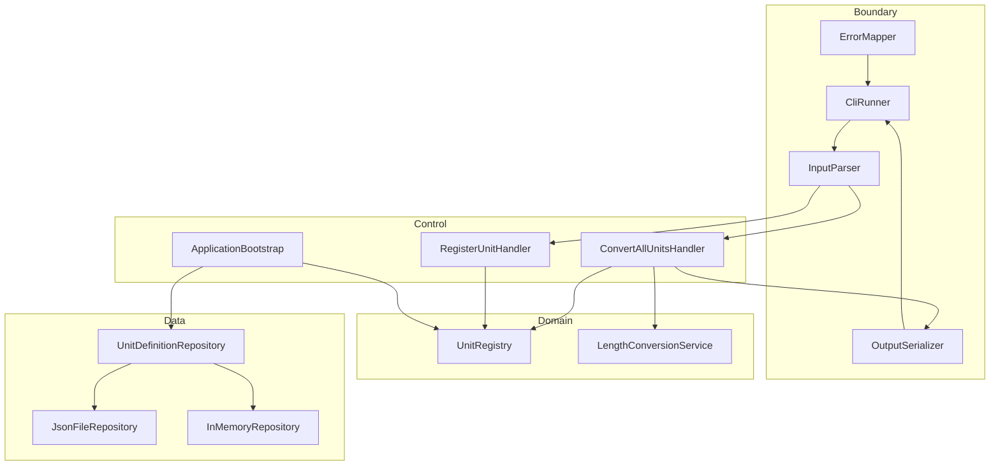

# UnitConverter_14

**C++/클린 아키텍처 학습자**를 위한 **meter 기준 길이 단위 변환 CLI** — 계약·테스트·BCE 레이어 분리를 6시간 실습으로 달성하는 학습용 프로젝트입니다.

## 목차

- [개요 (Overview)](#개요-overview)
- [빠른 시작 (Quick Start)](#빠른-시작-quick-start)
- [지원 단위 및 비율](#지원-단위-및-비율)
- [입력 형식 계약](#입력-형식-계약)
- [아키텍처](#아키텍처)
- [테스트 실행](#테스트-실행)
- [RED 단계 To-Do 리스트](#red-단계-to-do-리스트)
- [설정 파일 (JSON/YAML)](#설정-파일-jsonyaml)
- [출력 포맷](#출력-포맷)
- [기여 가이드 (Contributing)](#기여-가이드-contributing)
- [관련 문서](#관련-문서)
- [라이선스](#라이선스)

---

## 개요 (Overview)

### 이 프로젝트가 해결하는 문제

레거시 단일 파일 변환기에서는 **비율·파싱·출력**이 한곳에 묶여, 단위 추가나 포맷 변경 시 변경 범위를 예측하기 어렵고 회귀가 수동 확인에 의존합니다. 본 프로젝트는 **계약을 먼저 고정**하고 Catch2로 증명하여, 리팩토링·AI 보조 코드에서도 비율·에러·출력이 조용히 깨지지 않게 합니다.

### 주요 학습 목표

| 목표 | 내용 |
|------|------|
| **OCP** | 신규 단위 = Registry 등록만; 환산 알고리즘 파일 **변경 0** |
| **SRP** | Parser / Registry / Conversion / Serializer / Repository 분리 |
| **BCE** | Boundary → Control → Domain；Control → Data；Domain은 외부 레이어 미참조 |
| **TDD** | Dual-Track: Domain RED→GREEN → Boundary(Mock) → Data → 통합 |

> 본 과정의 1차 목표는 환산 **알고리즘 숙달**이 아니라 **계약·테스트·레이어 분리**입니다.

### PRD와의 연결

기능·인수·회귀·출력 스키마의 **단일 정본(Source of Truth)** 은 [docs/PRD.md](docs/PRD.md)입니다. 작업 추적은 [docs/TODO.md](docs/TODO.md)，레거시 실습 요구 원문은 [docs/requirements.md](docs/requirements.md)를 참고하세요.

| 문서 | 역할 |
|------|------|
| [PRD.md](docs/PRD.md) | 계약·인수 기준(AC)·회귀(REG)·커버리지 |
| [TODO.md](docs/TODO.md) | v1.0 Must/Should·마일스톤·RG 체크리스트 |
| [requirements.md](docs/requirements.md) | 6시간 Activities·최초 요구 스냅샷 |

---

## 빠른 시작 (Quick Start)

### 사전 조건

| 항목 | 요구 |
|------|------|
| 컴파일러 | **C++17** 이상（GCC 9+ / Clang 10+ / MSVC 2019+） |
| 빌드 | **CMake 3.16+**（v1.0 목표；[TODO M-01](docs/TODO.md)） |
| 테스트 | **Catch2 v3**（FetchContent 또는 시스템 설치） |

### 빌드 & 실행（v1.0 목표 명령）

> CMake 골격은 [TODO M-01](docs/TODO.md) 진행 중입니다. 완료 전 로컬 대안:

```bash
# 레거시（단일 파일）
g++ -std=c++17 -o UnitConverter UnitConverter.cpp
./UnitConverter
```

```bash
# v1.0 목표（CMake + Catch2）
cmake -S . -B build -DCMAKE_BUILD_TYPE=Debug
cmake --build build
ctest --test-dir build --output-on-failure
./build/UnitConverter
```

### 예시 입출력

**입력（stdin）**

```
meter:5.0
```

**출력（table, 기본 포맷）— 표시값 소수 1자리 half-up**

```
5 meter = 5 meter
5 meter = 16.4 feet
5 meter = 5.5 yard
```

| 검증 | 기대 |
|------|------|
| exit code | `0` |
| stderr | 빈 |
| feet | `5 × 3.28084 = 16.4042` → **16.4** |
| yard | `5 × 1.09361 = 5.46805` → **5.5** |

**출력 포맷 지정（v1.0 목표）**

```bash
./build/UnitConverter --format=json
./build/UnitConverter --format=csv
./build/UnitConverter --config=config/units.json
```

---

## 지원 단위 및 비율

모든 환산은 **meter 허브**만 사용합니다（feet↔yard 직접 상수 **금지**）。

| 단위명 | 식별자 (symbol) | meter 기준 (`meters_per_unit`) | 출처 |
|--------|-----------------|--------------------------------|------|
| meter | `meter` | **1.0** | PRD §5.1 기준 단위 |
| feet | `feet` | **1 / 3.28084** ≈ 0.3048 | `1 meter = 3.28084 feet` |
| yard | `yard` | **1 / 1.09361** ≈ 0.9144 | `1 meter = 1.09361 yard` |

**Domain 환산식**

```
target = source × meters_per_unit(source) / meters_per_unit(target)
```

- Domain 내부: 반올림 **없음**（raw `double`, ε = **1e-9**）
- Boundary 표시: target만 **소수 1자리 half-up**

---

## 입력 형식 계약

### CONVERT（변환）

| 항목 | 계약 |
|------|------|
| 패턴 | `{symbol}:{positive_decimal}` |
| 정규식 | `^([a-z0-9_]+):(\d+(\.\d+)?)$` |
| symbol | `[a-z0-9_]+` |

**정상 예시 3개**

| 입력 | 기대 |
|------|------|
| `meter:2.5` | exit 0；table 8.2 ft / 2.7 yd |
| `feet:10` | exit 0；전 등록 단위로 변환 |
| `yard:1` | exit 0；stderr 빈 |

### REGISTER（동적 등록）

| 항목 | 계약 |
|------|------|
| 패턴 | `1 {symbol} = {factor} meter` |
| 의미 | `meters_per_unit(symbol) = factor` |

**정상 예시**

```
1 cubit = 0.4572 meter
```

### 비정상 예시 3개 + 에러 패턴

| 입력 | ERR CODE | stderr 패턴（접두사 고정） |
|------|----------|---------------------------|
| `meter:2.5.3` | `INPUT_FORMAT` | `ERR-INPUT_FORMAT:` |
| `meter:-1` | `INPUT_NEGATIVE` | `ERR-INPUT_NEGATIVE:`（`-1` 포함） |
| `cubit:1`（미등록） | `INPUT_UNKNOWN_UNIT` | `ERR-INPUT_UNKNOWN_UNIT:`（`cubit` 포함） |

**공통 실패 계약**

| 항목 | 값 |
|------|-----|
| exit code | **1** |
| stdout | **빈**（변환 줄 0） |
| stderr | `ERR-{CODE}: {message}`（한 줄, 영문, 마침표 없음） |

### 음수·0 정책（POL-NEG）

| Policy | 규칙 |
|--------|------|
| POL-NEG-01 | length value **> 0** 만 허용 |
| POL-NEG-02 | 0·음수는 Boundary에서 거부, **변환 미호출** |
| POL-NEG-03 | stderr에 **raw 숫자 토큰** 포함 |

---

## 아키텍처

### BCE 레이어（Mermaid）



### 의존성 방향

```
Boundary → Control → Domain
Control  → Data (port)
Domain   ↛ Boundary, Data
```

| 레이어 | 책임 |
|--------|------|
| **Boundary** | stdin/argv 파싱, ERR-* 매핑, table/json/csv 직렬화 |
| **Control** | 유스케이스 오케스트레이션 |
| **Domain** | Registry, meter 허브 환산, 불변식 |
| **Data** | JSON/YAML 로드 → Registry 스냅샷 |

### 새 단위 추가 방법（코드 최소화）

| 단계 | 행위 | Conversion 알고리즘 변경 |
|------|------|--------------------------|
| 1 | `config/units.json`에 `{ "symbol": "cubit", "meters_per_unit": 0.4572 }` 추가 | **0** |
| 2 | 또는 실행 중 `1 cubit = 0.4572 meter` 입력 | **0** |
| 3 | `cubit:1` 등으로 CONVERT | **0** |
| 4 | Catch2에 cubit TC·golden 1줄 추가 | — |

**금지:** feet↔yard 전용 상수를 Domain에 추가（meter 허브 위반）。

---

## 테스트 실행

### 테스트 프레임워크

**Catch2 v3** — Domain / Boundary / Data / 통합 분리（[TODO](docs/TODO.md) M-01~S-12）.

### 명령

```bash
cmake -S . -B build -DCMAKE_BUILD_TYPE=Debug
cmake --build build
ctest --test-dir build --output-on-failure
```

```bash
# 특정 태그（목표 구조）
./build/tests --list-tests
./build/tests "[domain]"
./build/tests "[boundary]"
```

### 커버리지 목표（PRD §4.3）

| 레이어 | line | branch |
|--------|------|--------|
| Domain | ≥ **98%** | ≥ **95%** |
| Boundary | ≥ **90%** | ≥ **85%** |
| Data | ≥ **90%** | — |
| **전체** | ≥ **85%** | — |

**Gate:** Domain 미달 → v1.0 인수 불가（[PRD AC-06](docs/PRD.md)）.

### 회귀（PR 전 필수）

[docs/TODO.md § 회귀 방지](docs/TODO.md) **RG-01~09** — golden diff 0, ERR CODE 동결, POL-NEG 유지.

---

## RED 단계 To-Do 리스트

> 이 체크리스트는 test_plan.md 기반으로 생성되었습니다.
> 각 항목은 RED(실패 테스트 작성) 완료 시 체크합니다.

### Track A — UI / Boundary 테스트
- [x] TC-A-01: 정상 입력 "meter:2.5" → 변환 결과 반환 (Happy Path)
- [x] TC-A-02: ":" 없는 입력 → std::invalid_argument 발생
- [x] TC-A-03: 음수 입력 "meter:-1.0" → std::invalid_argument 발생
- [ ] TC-A-04: 없는 단위 "parsec:1.0" → std::invalid_argument 발생
- [ ] TC-A-05: 소수점 파싱 실패 "meter:abc" → std::invalid_argument 발생
- [ ] TC-A-06: 출력 포맷에 원 입력 단위·값 보존 ("2.5 meter = ...")
- [ ] TC-A-07: value=0 경계값 처리 확인

### Track B — Domain / Logic 테스트
- [ ] TC-B-01: convert("meter", 2.5, "feet") == 8.20210 (오차 1e-5)
- [ ] TC-B-02: convert("meter", 1.0, "yard") == 1.09361 (오차 1e-5)
- [ ] TC-B-03: convert("feet", 1.0, "meter") == 0.30480 (역변환)
- [ ] TC-B-04: convertAll("meter", 1.0) → 모든 등록 단위 변환 반환
- [ ] TC-B-05: registerUnit("cubit", 0.4572) 후 변환 가능
- [ ] TC-B-06: loadConfig(유효한 경로) → 비율 정상 로드
- [ ] TC-B-07: loadConfig(없는 경로) → 기본값(3.28084/1.09361) 유지

### 커버리지 목표
- [ ] Domain Logic: 95%+ (# gcov / lcov)
- [ ] Boundary Layer: 85%+
- [ ] 전체 TOTAL: 90%+

### 결함 목록 연결
- [x] [defect_list.md](docs/defect_list.md) 생성 및 발견 결함 기록 (DEF-001~DEF-023)
- [x] 모든 **제품 결함**(DEF-001~DEF-017) 수정 후 회귀 테스트 통과 확인 (`ctest` 45/45 Green; 인프라·Should Open: DEF-018~023)

---

## 설정 파일 (JSON/YAML)

### 위치（권장）

```
config/
  units.json          # 기본 부트스트랩
  units.invalid.json  # 스키마 실패 TC용（선택）
```

### JSON 형식 예시（필수 지원）

```json
{
  "base_unit": "meter",
  "units": [
    { "symbol": "meter", "meters_per_unit": 1.0 },
    { "symbol": "feet", "meters_per_unit": 0.3048 },
    { "symbol": "yard", "meters_per_unit": 0.9144 }
  ]
}
```

| 실패 조건 | ERR CODE |
|-----------|----------|
| 파일 없음 / JSON 파싱 실패 | `ERR-CONFIG_LOAD` |
| meter 누락 / `meters_per_unit` ≤ 0 | `ERR-CONFIG_SCHEMA` |

### YAML（선택, v2.0 후보）

JSON과 동일 필드(`base_unit`, `units[]`) — [TODO N-02](docs/TODO.md).

### 동적 단위 등록（런타임）

**형식:** `register:` 접두사 없음.

```
1 cubit = 0.4572 meter
cubit:1
```

| 실패 | ERR CODE |
|------|----------|
| factor ≤ 0 | `ERR-INPUT_INVALID_FACTOR` |
| 중복 symbol | `ERR-INPUT_DUPLICATE_REGISTER` |

---

## 출력 포맷

공통: **Source preservation** — 입력 `unit`·`value`는 모든 포맷에서 **변경 없음**. target만 1자리 half-up.

기본: `--format=table`（생략 시 table）

### 콘솔（Table）

**입력:** `meter:2.5`

```
2.5 meter = 8.2 feet
2.5 meter = 2.7 yard
```

| 규칙 | 값 |
|------|-----|
| 패턴 | `{source_value} {source_unit} = {target_value} {target_unit}` |
| 줄 수 | `Registry.size()` |

### JSON

**입력:** `meter:2.5` + `--format=json`

```json
{
  "source": { "unit": "meter", "value": 2.5 },
  "conversions": [
    { "unit": "feet", "value": 8.2 },
    { "unit": "yard", "value": 2.7 }
  ]
}
```

### CSV

**입력:** `meter:2.5` + `--format=csv`

```csv
source_unit,source_value,target_unit,target_value
meter,2.5,feet,8.2
meter,2.5,yard,2.7
```

| 규칙 | 값 |
|------|-----|
| 헤더 | `source_unit,source_value,target_unit,target_value`（고정） |
| 데이터 행 | Registry.size() |

---

## 기여 가이드 (Contributing)

### 계약 변경 금지 원칙

| 변경 유형 | 허용 조건 |
|-----------|-----------|
| Background 비율 3.28084 / 1.09361 | **금지**（의도 bump 시 PRD·Gherkin·drift TC **동시** 개정） |
| `ERR-{CODE}` 집합 | 신규 CODE는 TC + [PRD 부록](docs/PRD.md) **추가 후만** |
| POL-NEG-01~03 | **삭제·완화 금지** |
| Source preservation (OUT-03) | **삭제 금지** |
| golden (table/json/csv) | 의도 외 diff → **PR 거부** |

### 테스트 없는 PR 거부 정책

| PR 유형 | 최소 요구 |
|---------|-----------|
| 기능 | Catch2 TC 1건 이상 + 해당 AC ID 명시 |
| 버그 수정 | 재현 TC + 회귀 TC |
| 리팩토링 | 기존 `ctest` **전부 Green** + golden diff 0 |
| 계약 변경 | PRD diff + Gherkin diff + RG 체크리스트 |

### 커밋 메시지 컨벤션

```
<type>(<scope>): <subject>

<body: AC-xx or M-xx / REG-xx reference>
```

| type | 용도 |
|------|------|
| `feat` | F-xx 기능（Boundary, Data 등 scope 명시） |
| `test` | TC·golden·커버리지 |
| `refactor` | 동작 동일, OCP/SRP 구조 |
| `docs` | PRD, README, TODO |
| `fix` | 계약 버그 |

**scope 예:** `domain`, `boundary`, `control`, `data`, `docs`

### v1.0 기여 순서（권장）

[docs/TODO.md](docs/TODO.md) 마일스톤 순: **MS-1 Domain → MS-2 Boundary → MS-3 확장 → MS-4 RG Gate**

---

## 관련 문서

| 문서 | 설명 |
|------|------|
| [docs/PRD.md](docs/PRD.md) | 제품 요구 정본（AC, REG, 스키마） |
| [docs/TODO.md](docs/TODO.md) | Must/Should/마일스톤/회귀 체크리스트 |
| [docs/test_plan.md](docs/test_plan.md) | Catch2 TC·경계값·커버리지 Gate |
| [docs/defect_list.md](docs/defect_list.md) | RED→GREEN 결함 목록（DEF-001~023） |
| [docs/requirements.md](docs/requirements.md) | 원본 6시간 실습 요구 |

---

## 라이선스

**MIT License** — 학습·실습·포크 자유. 상용 보증 없음.

```
MIT License

Copyright (c) 2026 UnitConverter_14 contributors

Permission is hereby granted, free of charge, to any person obtaining a copy
of this software and associated documentation files (the "Software"), to deal
in the Software without restriction, including without limitation the rights
to use, copy, modify, merge, publish, distribute, sublicense, and/or sell
copies of the Software, and to permit persons to whom the Software is
furnished to do so, subject to the following conditions:

The above copyright notice and this permission notice shall be included in all
copies or substantial portions of the Software.

THE SOFTWARE IS PROVIDED "AS IS", WITHOUT WARRANTY OF ANY KIND, EXPRESS OR
IMPLIED, INCLUDING BUT NOT LIMITED TO THE WARRANTIES OF MERCHANTABILITY,
FITNESS FOR A PARTICULAR PURPOSE AND NONINFRINGEMENT.
```
