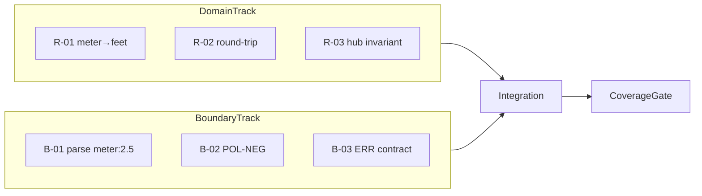

# 테스트 계획서 — UnitConverter_14

| 항목 | 내용 |
|------|------|
| 문서 버전 | 1.0 |
| 작성 관점 | 시니어 QA 리드 |
| 기준 샘플 | `meter:2.5` → `2.5 meter = 8.2 feet`, `2.5 meter = 2.7 yard` |
| 기술 스택 | C++17, CMake, Catch2 v3 |
| 참조 문서 | [requirements.md](requirements.md), [PRD.md](PRD.md), [TODO.md](TODO.md) |
| 레거시 기준선 | `UnitConverter.cpp`（단일 파일, meter 허브 3단위） |

---

## 1. 목적 및 범위

### 1.1 목적

- **meter→feet** 환산을 대표 샘플로, Domain 정확도·Boundary 계약·회귀 자동화의 **검증 기준**을 고정한다.
- Dual-Track TDD（Domain Track / Boundary Track）에 맞춰 Catch2 TC의 **우선순위·경계값·커버리지 Gate**를 정의한다.
- 레거시 `UnitConverter.cpp`에서 BCE 분리 구현으로 이행할 때 **동일 계약**이 유지되는지 측정 가능하게 한다.

### 1.2 In-Scope

| 구분 | 내용 |
|------|------|
| Domain | `UnitRegistry`, `LengthConversionService`, meter 허브 환산식, ε 검증 |
| Boundary | `unit:value` 파싱, POL-NEG, ERR-* 매핑, table/json/csv 표시（1자리 half-up） |
| 통합 | stdin/stdout/stderr, exit code, golden 회귀 |
| 커버리지 | Domain **line ≥95%**, branch **≥95%**；Boundary **line ≥85%**, branch **≥85%** |

### 1.3 Out-of-Scope（본 계획서 1차）

- GUI / 웹 클라이언트
- feet↔yard **직접** 고정 비율（NG-03：meter 허브만 허용）
- 상용 CI/CD SLA（로컬 gcov/lcov 측정만 정의）

### 1.4 샘플 예제 기준값（Golden）

입력: `meter:2.5`

| 검증층 | 기대 | 비고 |
|--------|------|------|
| Domain（raw double） | feet = `2.5 × 3.28084` = **8.2021** | 반올림 **없음**（C-05） |
| Domain（raw double） | yard = `2.5 × 1.09361` = **2.734025** | ε = **1e-9** |
| Boundary（표시） | `2.5 meter = 8.2 feet` | 소수 1자리 **half-up**（C-06） |
| Boundary（표시） | `2.5 meter = 2.7 yard` | 동일 |
| CLI | exit **0**, stderr **빈** | 성공 경로 |

---

## 2. 테스트 전략 개요

### 2.1 Dual-Track TDD



| 트랙 | 목표 | 실패 시 의미 |
|------|------|----------------|
| **Domain** | 환산 수학·Registry 불변식 | 비율 drift, NG-03 위반 |
| **Boundary** | 파싱·에러·표시 계약 | 사용자 입력 계약 깨짐 |

### 2.2 테스트 피라미드

| 레벨 | 비율（권장） | 도구 | 예시 |
|------|-------------|------|------|
| 단위（Domain/Boundary） | ~70% | Catch2 `[domain]`, `[boundary]` | `LengthConversionService` ε TC |
| 통합（Control + fake IO） | ~20% | Catch2 `[integration]` | Handler + InMemory Registry |
| E2E（CLI subprocess） | ~10% | Catch2 + golden 파일 | `meter:2.5` stdout 스냅샷 |

---

## 3. Catch2 단위 테스트 — 범위 및 우선순위

### 3.1 Catch2 구성（목표）

```
tests/
  domain/
    test_length_conversion.cpp      # [domain]
    test_unit_registry.cpp
  boundary/
    test_convert_parser.cpp         # [boundary]
    test_table_serializer.cpp
  integration/
    test_convert_use_case.cpp
```

CMake: 테스트 타깃 `unit_converter_tests`, `ctest` 연동, `-DCMAKE_BUILD_TYPE=Debug` + `--coverage` 옵션（§7）.

### 3.2 우선순위 정의

| 우선순위 | 의미 | 완료 기준 |
|----------|------|-----------|
| **P0** | 릴리스·인수 Gate | 100% Green, 커버리지 Gate 통과 |
| **P1** | 1차 기능 완성 | Green, Domain/Boundary 목표의 90% 도달 |
| **P2** | 확장·회귀 보강 | Green, 문서화된 예외만 허용 |

### 3.3 Domain Track（`[domain]`）— P0

| TC ID | 제목 | 입력/조건 | 기대 | 우선순위 |
|-------|------|-----------|------|----------|
| **R-01** | meter→feet 환산 | source=meter, value=2.5, target=feet | `≈ 8.2021`（ε=1e-9） | P0 |
| **R-02** | feet→meter 역환산 | feet=8.2021, target=meter | `≈ 2.5`（round-trip） | P0 |
| **R-03** | meter 허브 일관성 | feet→yard | `feet→meter→yard` = 직접 상수 **금지** 경로만 | P0 |
| **R-04** | Bootstrap Registry | 기본 3단위 | size=3, meter `meters_per_unit=1.0` | P0 |
| **R-05** | 비율 drift 방지 | feet factor | `1/3.28084`（또는 설정값）고정 스냅샷 | P0 |
| R-06 | yard→feet 교차 | value=1.0 | ε 통과 | P1 |
| R-07 | 동적 등록 후 환산 | cubit 등록 후 `cubit:1` | meter-chain ε | P1 |

**R-01 상세（샘플）**

```cpp
// Catch2 v3 예시（의사코드）
TEST_CASE("R-01 meter to feet at 2.5", "[domain]") {
    auto registry = UnitRegistry::bootstrapDefault();
    LengthConversionService svc{registry};
    const auto result = svc.convert("meter", 2.5, "feet");
    REQUIRE(result == Catch::Approx(2.5 * 3.28084).epsilon(1e-9));
}
```

### 3.4 Boundary Track（`[boundary]`）— P0 / P1

| TC ID | 제목 | 입력 | 기대 CODE / 동작 | 우선순위 |
|-------|------|------|------------------|----------|
| **B-01** | 정상 파싱 | `meter:2.5` | Parse OK → Control 호출 | P0 |
| **B-02** | 표시 half-up | `meter:2.5` table | `8.2 feet`, `2.7 yard` | P0 |
| **B-03** | 콜론 누락 | `meter2.5` | `ERR-INPUT_FORMAT:`, exit 1, stdout 빈 | P0 |
| **B-04** | 이중 소수점 | `meter:2.5.3` | `ERR-INPUT_FORMAT:` | P0 |
| **B-05** | 숫자 파싱 실패 | `meter:abc` | `ERR-INPUT_FORMAT:`（또는 전용 CODE 문서화） | P0 |
| **B-06** | 영값 | `meter:0` | `ERR-INPUT_NEGATIVE:`（POL-NEG-01） | P0 |
| **B-07** | 음수 | `meter:-1` | `ERR-INPUT_NEGATIVE:`（raw `-1` 포함） | P0 |
| **B-08** | 미등록 단위 | `parsec:1.0` | `ERR-INPUT_UNKNOWN_UNIT:`（`parsec` 포함） | P0 |
| B-09 | 매우 큰 수 | `meter:1e308` | 정책별（§4.2） | P1 |
| B-10 | argv `--format=json` | `meter:2.5` | JSON schema + 8.2/2.7 | P1 |

> **레거시 주의:** 현재 `UnitConverter.cpp`는 `meter:0`·음수를 **거부하지 않음**. B-06/B-07은 **목표 계약**이며, RED 단계에서 실패 → GREEN에서 Boundary 구현으로 충족한다.

### 3.5 Data / 통합 — P1 / P2

| TC ID | 영역 | 우선순위 |
|-------|------|----------|
| D-01 | 유효 `units.json` 로드 = US-03 동일 결과 | P1 |
| D-02 | `ERR-CONFIG_LOAD` / `ERR-CONFIG_SCHEMA` | P1 |
| I-01 | E2E `meter:2.5` golden stdout | P0 |
| I-02 | 실패 시나리오 ≥5건 stderr `^ERR-[A-Z_]+:` | P0 |

---

## 4. 경계값 및 예외/특이 케이스

### 4.1 경계값 케이스 목록（필수）

사용자 요청 항목과 PRD 계약을 매핑한다.

| # | 케이스 | 입력 예시 | 기대 동작 | Catch2 TC | 우선순위 |
|---|--------|-----------|-----------|-----------|----------|
| 1 | **영값 변환** | `meter:0` | **거부** — `ERR-INPUT_NEGATIVE:`；변환 서비스 **미호출**（POL-NEG-01） | B-06 | P0 |
| 2 | **매우 큰 수（오버플로 위험）** | `meter:1e308`, `meter:1e100` | Boundary: 파싱 성공 여부 명시；Domain: `double` overflow/inf 시 **정책 결정**（아래 §4.2） | B-09 | P1 |
| 3 | **음수 입력 정책** | `meter:-1`, `feet:-0.1` | `ERR-INPUT_NEGATIVE:`；stderr에 raw 토큰；exit 1；stdout 빈 | B-07 | P0 |
| 4 | **소수점 파싱 실패** | `meter:abc` | `ERR-INPUT_FORMAT:`（레거시: `Invalid number: abc` → 계약 통일） | B-05 | P0 |
| 5 | **콜론 없는 입력** | `meter2.5`, `feet10` | `ERR-INPUT_FORMAT:` | B-03 | P0 |
| 6 | **없는 단위** | `parsec:1.0` | `ERR-INPUT_UNKNOWN_UNIT:`（레거시: `Unknown unit: parsec`） | B-08 | P0 |

**추가 경계（PRD AC-02）**

| 입력 | CODE |
|------|------|
| `meter:2.5.3` | `ERR-INPUT_FORMAT:` |
| `cubit:1`（미등록） | `ERR-INPUT_UNKNOWN_UNIT:` |
| 빈 줄 / 공백만 | `ERR-INPUT_FORMAT:` |

### 4.2 매우 큰 수 — 오버플로 정책（QA 결정안）

| 단계 | 검증 내용 | 기대 |
|------|-----------|------|
| 파싱 | `std::stod` / 정규식 통과 범위 | `1e308` 등은 파싱 성공 가능 |
| Domain | `source × factor / factor` | `inf`/`nan` 발생 시 **명시적 실패** 또는 `ERR-INPUT_OVERFLOW`（신규 CODE 시 TC+PRD 동시 갱신） |
| 표시 | Boundary | `inf` 출력 **금지**（사전 거부 권장） |

**P1 TC 제안:** `meter:1e200` → 유한한 양수 결과 유지；`meter:1e309` → 파싱 실패 또는 `ERR-INPUT_FORMAT`（구현 선택을 TC에 고정）.

### 4.3 음수 입력 정책（POL-NEG 요약）

| Policy | Rule |
|--------|------|
| POL-NEG-01 | length value **> 0** 만 허용 |
| POL-NEG-02 | 0·음수는 Boundary에서 차단, Domain 미호출 |
| POL-NEG-03 | stderr에 입력의 **숫자 토큰** 포함（예: `-1`） |

### 4.4 예외 및 특이 케이스 목록

| 분류 | 시나리오 | 기대 | TC 유형 |
|------|----------|------|---------|
| **형식** | 단위 심볼 대문자 `Meter:1` | `ERR-INPUT_FORMAT` 또는 unknown（정규식 `^([a-z0-9_]+):`） | Boundary |
| **형식** | 빈 단위 `:1.0` | `ERR-INPUT_FORMAT` | Boundary |
| **형식** | 값 누락 `meter:` | `ERR-INPUT_FORMAT` | Boundary |
| **형식** | 선행/후행 공백 ` meter : 2.5 ` | 문서화된 trim 정책（권장: trim 후 성공） | Boundary |
| **단위** | 알려진 오타 `metre:1` | `ERR-INPUT_UNKNOWN_UNIT` | Boundary |
| **단위** | 중복 콜론 `meter:1:2` | `ERR-INPUT_FORMAT` | Boundary |
| **환산** | 동일 단위 `meter:2.5` → meter 줄 | source value 유지（2.5 meter） | Domain + 표시 |
| **환산** | feet 입력 `feet:10` | meter 허브 경유 결과 ε | Domain P1 |
| **설정** | `bad_schema.json`（meter 누락） | `ERR-CONFIG_SCHEMA`, stdout 0줄 | Data P1 |
| **등록** | `1 cubit = 0 meter` | `ERR-INPUT_INVALID_FACTOR` | Boundary P2 |
| **등록** | 중복 symbol | `ERR-INPUT_DUPLICATE_REGISTER` | Boundary P2 |
| **출력** | `--format=unknown` | `ERR-INPUT_FORMAT` | Boundary P2 |
| **동시성** | （NG）멀티스레드 | 단일 스레드 CLI 가정 — TC 없음 | N/A |
| **레거시 갭** | `meter:0` 현재 **허용** | 리팩토링 후 B-06 RED→GREEN | 회귀 |

### 4.5 실패 계약 체크리스트（G-03）

모든 실패 TC는 다음을 **동시에** 검증한다.

- [ ] process exit code = **1**
- [ ] **stdout 비어 있음**（변환 줄 0）
- [ ] stderr 한 줄, `^ERR-[A-Z_]+:` 매칭
- [ ] （해당 시）symbol 또는 raw number 토큰 포함

---

## 5. 커버리지 목표

### 5.1 Gate（본 계획서 — 사용자 지정）

| 레이어 | Line | Branch | 인수 |
|--------|------|--------|------|
| **Domain** | **≥ 95%** | **≥ 95%** | 미달 시 **인수 불가** |
| **Boundary** | **≥ 85%** | **≥ 85%** | 통합 TC 전부 Green + 예외 문서화 시 1회 완화 가능 |
| Data | ≥ 90% | — | 권장 |
| **전체** | ≥ 85% | — | PRD 정렬 |

> PRD §4.3 stretch: Domain line 98% / Boundary line 90% — 여유 있을 때 상향.

### 5.2 파일·모듈별 매핑（리팩토링 후）

| 소스（예상 경로） | 레이어 | 커버리지 주체 TC |
|-------------------|--------|------------------|
| `src/domain/LengthConversionService.cpp` | Domain | R-01~R-07 |
| `src/domain/UnitRegistry.cpp` | Domain | R-04, R-07 |
| `src/boundary/ConvertInputParser.cpp` | Boundary | B-01, B-03~B-08 |
| `src/boundary/TableOutputSerializer.cpp` | Boundary | B-02 |
| `src/control/*Handler.cpp` | Boundary+통합 | I-01, I-02 |
| `UnitConverter.cpp`（레거시 main） | Boundary/E2E | I-01；분리 후 **thin main**만 |

### 5.3 미커버 허용（문서화 필수）

- `main` 진입점 argv 분기 중 미사용 플래그
- 방어적 `default` 분기（도달 불가 증명 시 `#pragma LCOV_EXCL` 검토）
- 플랫폼별 `#ifdef`（Windows/Linux 차이）

---

## 6. 추적성（Requirements → TC）

| 요구 ID | 설명 | TC |
|---------|------|-----|
| F-01 | `unit:value` 변환 | R-01, B-01, I-01 |
| F-02 | 입력 검증 | B-03~B-08, §4.1 전체 |
| F-03 | Registry + meter 허브 | R-03, R-04, NG-03 |
| C-03 / POL-NEG | value > 0 | B-06, B-07 |
| C-06 | 1자리 half-up | B-02 |
| G-02 | README 8.2 / 2.7 | B-02, I-01 golden |
| AC-01 | `meter:2.5` 성공 | I-01 |
| AC-02 | 실패 ≥5 | B-03~B-08, I-02 |

---

## 7. gcov / lcov 측정 전략

### 7.1 원칙

- **Debug + coverage flags**로 빌드한다（최적화 `-O0` 권장, 인라인으로 인한 줄 커버리지 왜곡 최소화）.
- `UnitConverter.cpp`는 레거시 단계에서 **전체 로직이 한 파일**에 있으므로, 초기에는 **파일 단위** 측정 후 BCE 분리 시 **타깃별 `lcov --extract`**로 전환한다.
- Catch2 단위 테스트가 **Domain/Boundary 소스**를 직접 링크해야 한다（`main`만 subprocess로 돌리면 Domain line이 0%에 가깝다）.

### 7.2 CMake 옵션（권장 스니펫）

```cmake
option(ENABLE_COVERAGE "Build with gcov coverage" OFF)

if(ENABLE_COVERAGE AND CMAKE_CXX_COMPILER_ID MATCHES "GNU|Clang")
  add_compile_options(--coverage -O0 -g)
  add_link_options(--coverage)
endif()
```

### 7.3 빌드·실행·리포트（GCC / MinGW / Linux）

```bash
# 1) 커버리지 빌드
cmake -S . -B build-cov -DCMAKE_BUILD_TYPE=Debug -DENABLE_COVERAGE=ON
cmake --build build-cov

# 2) 테스트 실행（.gcda 생성）
ctest --test-dir build-cov --output-on-failure

# 3) gcov（파일 단위 — UnitConverter.cpp）
cd build-cov
gcov -b -c ../UnitConverter.cpp    # 또는 객체 경로에 맞게 조정
# 리팩토링 후 예:
# gcov -b -c ../src/domain/LengthConversionService.cpp

# 4) lcov 수집（전체）
lcov --capture --directory . --output-file coverage.info
lcov --remove coverage.info '/usr/*' '*/catch2/*' '*/tests/*' --output-file coverage.filtered.info

# 5) HTML 리포트
genhtml coverage.filtered.info --output-directory coverage-html
```

### 7.4 `UnitConverter.cpp` 전용 측정 절차

| 단계 | 명령/행위 | 목적 |
|------|-----------|------|
| A | `-DENABLE_COVERAGE=ON`로 **테스트 타깃 + 실행 파일** 동시 빌드 | .gcda 생성 경로 통일 |
| B | `ctest` **전체** 실행 | 파싱·환산·출력 분기 커버 |
| C | `gcov -b -c` on `UnitConverter.cpp` | **줄·분기** 히트맵 확인（콘솔） |
| D | `lcov --extract` with `*UnitConverter.cpp*` | 레거시 파일 Gate 추적 |
| E | 분리 후 `*domain*`, `*boundary*` 패턴 extract | §5.2 레이어별 Gate |

**레거시 한계 보완:** `main`만 포함된 실행 파일로 측정하면 **파싱 실패 분기**가 테스트되지 않을 수 있다. 반드시:

1. 로직을 **static library**（`unit_converter_core`）로 추출하고
2. Catch2가 core를 링크하며
3. E2E는 subprocess로 **실패 입력 5건+** 실행

### 7.5 분기 커버리지 — 필수 hit 분기（`UnitConverter.cpp` 기준）

| 분기 | 케이스로 hit |
|------|----------------|
| `pos == npos` | `meter2.5` |
| `stod` 예외 | `meter:abc` |
| `unit == meter/feet/yard/else` | 각 1건 + `parsec:1.0` |
| 정상 출력 3줄 | `meter:2.5` |

리팩토링 후 Domain 파일에서는 `unit ==` 체인이 **제거**되고 Registry 루프로 대체되므로, R-04·R-07로 **루프 진입·미등록** 분기를 커버한다.

### 7.6 CI / 로컬 Gate 스크립트（권장）

```bash
# coverage_gate.sh（의사）
lcov --summary coverage.filtered.info | tee summary.txt
# Domain extract
lcov --extract coverage.filtered.info '*/domain/*' -o domain.info
lcov --summary domain.info  # line >= 95%, branch >= 95%
# Boundary extract
lcov --extract coverage.filtered.info '*/boundary/*' -o boundary.info
# line >= 85%, branch >= 85%
```

Windows（MSVC）는 `gcov` 미지원 → **WSL 또는 MinGW-w64 + gcc**로 동일 파이프라인 실행을 QA Gate로 고정한다.

### 7.7 측정 주기

| 시점 | 활동 |
|------|------|
| RED 커밋 | 실패 TC만 추가, 커버리지 **참고** |
| GREEN 커밋 | Domain R-01~R-05 Green + lcov Domain ≥95% |
| Boundary GREEN | §4.1 six pack Green + Boundary ≥85% |
| REFACTOR PR | golden diff 0 + 커버리지 **하락 없음** |

---

## 8. 테스트 데이터 및 산출물

### 8.1 Golden 파일（권장）

```
tests/fixtures/golden/
  meter_2_5_table.txt
  meter_2_5.json
  errors/
    meter_abc.stderr
    parsec_1_0.stderr
```

### 8.2 ε 및 표시 헬퍼

- Domain: `Catch::Approx(x).epsilon(1e-9)`
- Boundary: `FormatLengthValue(8.2021) == "8.2"` half-up 단위 테스트

---

## 9. 일정 및 완료 기준（Activities 정렬）

| Activity | 테스트 산출 | 완료 기준 |
|----------|-------------|-----------|
| 2. 기본 구현 | P0 Domain + Boundary RED/GREEN | R-01, B-01~B-02 Green |
| 3. TC 구현 | §4.1 six pack + I-02 | 실패 ≥5 자동화 |
| 4. 추가 요구 | D-01, B-10, R-07 | 설정·포맷·등록 TC |
| 5. 회고 | lcov HTML + Gate 표 | Domain ≥95%, Boundary ≥85% |

**Definition of Done（MS-1~M-10）**

- [ ] `ctest` 전체 Green
- [ ] `meter:2.5` golden 일치（8.2 / 2.7）
- [ ] §4.1 경계값 6종 + PRD AC-02 실패 케이스 Green
- [ ] lcov Domain line ≥95%, branch ≥95%
- [ ] lcov Boundary line ≥85%, branch ≥85%
- [ ] `UnitConverter.cpp` 또는 분리된 core에 대해 §7.5 분기 hit 확인

---

## 10. 리스크 및 완화

| 리스크 | 영향 | 완화 |
|--------|------|------|
| 레거시가 POL-NEG 미구현 | AC-02 불일치 | B-06/B-07 RED 우선 |
| 단일 파일 gcov가 Boundary/Domain 혼재 | Gate 왜곡 | 조기 library 분리 |
| `double` 대수 오차 누적 | false negative | ε=1e-9, 표시는 Boundary만 검증 |
| half-up 구현 차이 | 8.2 vs 8.3 | B-02 고정 + golden |
| MSVC coverage 불가 | Gate 스킵 | WSL gcc 파이프라인 필수화 |

---

## 부록 A — 레거시 vs 목표 계약 diff

| 입력 | 레거시 `UnitConverter.cpp` | 목표 계약 |
|------|---------------------------|-----------|
| `meter:0` | **허용**（0 출력） | `ERR-INPUT_NEGATIVE` |
| `meter:-1` | **허용** | `ERR-INPUT_NEGATIVE` |
| `meter:abc` | `Invalid number: abc` | `ERR-INPUT_FORMAT:` |
| `parsec:1.0` | `Unknown unit: parsec` | `ERR-INPUT_UNKNOWN_UNIT:` |
| stderr 형식 | 자유 텍스트 | `ERR-{CODE}:` |

회귀 TC는 **목표 계약**을 기준으로 작성하고, 레거시 통과 여부와 분리한다.

---

## 부록 B — 빠른 실행 치트시트

```bash
cmake -S . -B build -DCMAKE_BUILD_TYPE=Debug
cmake --build build
./build/unit_converter_tests "[domain]"   # R-01 우선
./build/unit_converter_tests "[boundary]" # B-01~B-08
ctest --test-dir build --output-on-failure

# 커버리지 Gate
cmake -S . -B build-cov -DENABLE_COVERAGE=ON
cmake --build build-cov && ctest --test-dir build-cov
# → §7.3 lcov/genhtml
```

---

*문서 끝 — 변경 시 PRD §3.3 Canonical ratios 및 golden fixture를 동시 갱신할 것.*
